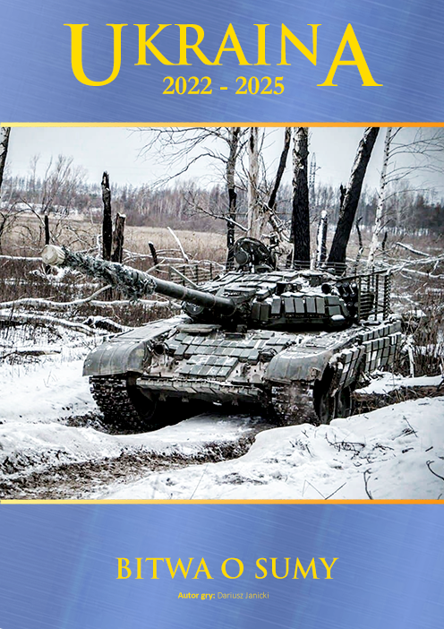
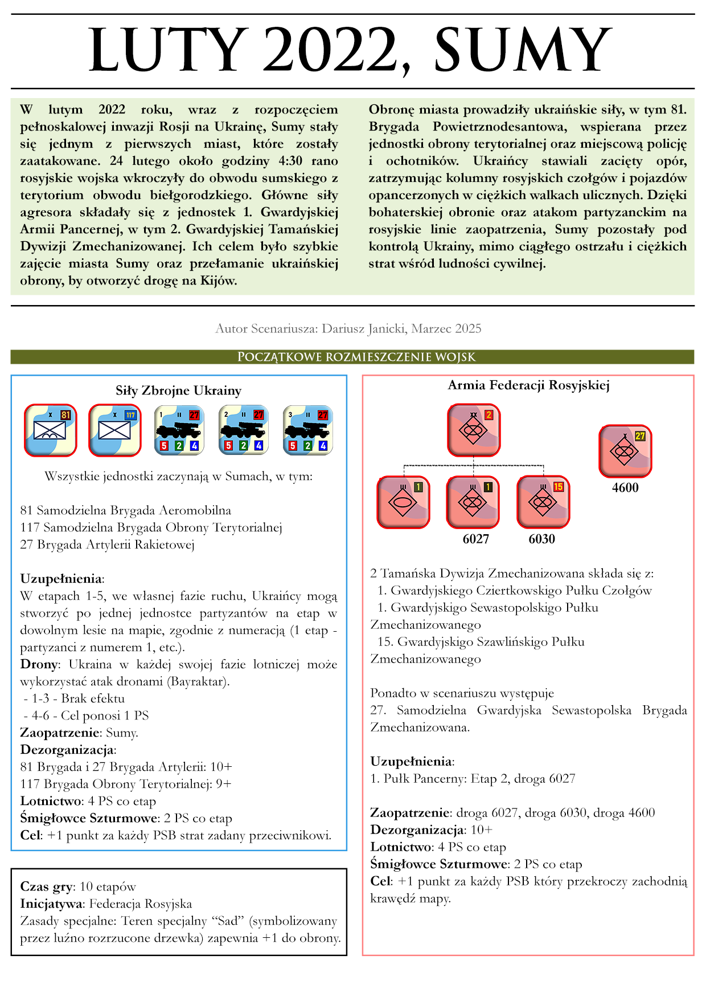

# Ukraina 2022

Ukraina 2022 to seria wirtualnych gier planszowych zrealizowanych w silniku Vassal w systemie World War 3 (WW3) wydawnictwa Taktyka i Strategia (Gry w tym systemie można kupić np. tu https://taktykaistrategia.pl/kategoria-produktu/nasze-gry/?filter_system=ww3&query_type_system=or)

Ukraina 2022 to próba odtworzenia i upamiętnienia historycznych starć, jakie miały miejsce podczas Rosyjskiej Inwazji na Ukrainę (2022-).

## Jak uruchamiać

Do gry niezbędna jest aplikacja Vassal. Jest to darmowy silnik do uruchamiania wirtualnych gier planszowych. Można ją pobrać tutaj: https://vassalengine.org/download.html

* Pobierz i uruchom moduł **WW3.vmod**. Jest to podstawowa wersja gry, nie zawiera scenariuszy.
* W folderze ze scenariuszami pobierz odpowiedni plik **Rozszerzenie - xxx.vmdx** i zainstaluj go jako dodatek do modułu **Kryzys 2025** w Vassal.

## Struktura repozytorium

``` yaml
Kryzys-2025/
│
├── System World War 3.vmod  # Plik zawierający moduł Vassal
└── scenarios/               # Katalogi scenariuszy:
  └── [nazwa_scenariusza]/
    ├── graphics/            # Mapy, jednostki, okładki, screeny
    ├── scenario/            # Opisy scenariuszy i zmiany zasad
    ├── psd/                 # Źródła graficzne (Photoshop)
    ├── saves/               # Zapisy do gry (np. rozstawienie początkowe)
    ├── *.vmdx               # Rozszerzenie do głównego modułu
    └── *.vmod               # Czasem osobny moduł dla danego scenariusza
```

## Scenariusze
### 1️⃣ Sumy, Luty 2022 


Pierwsze dni wojny, dzielni obrońcy z wojsk terytorialnych okręgu sumskiego próbują powtrzymać marsz najeźdźcy w stronę Kijowa.

<details>
<summary>1️⃣ Sumy, Luty 2022</summary>
* 
</details>
